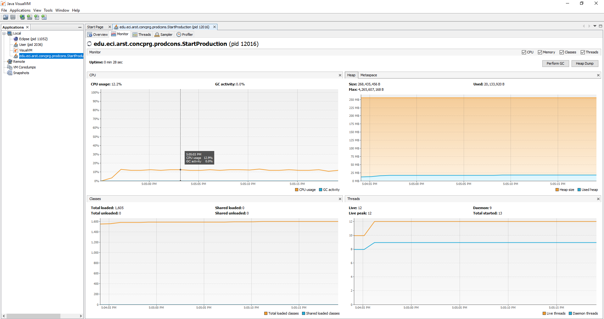
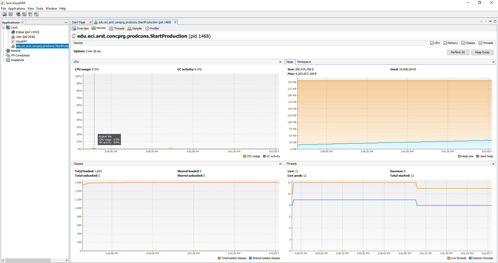
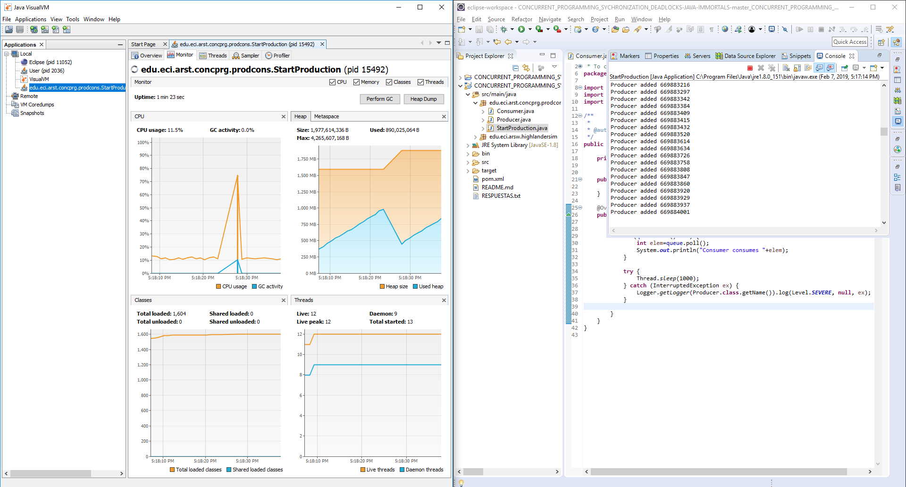
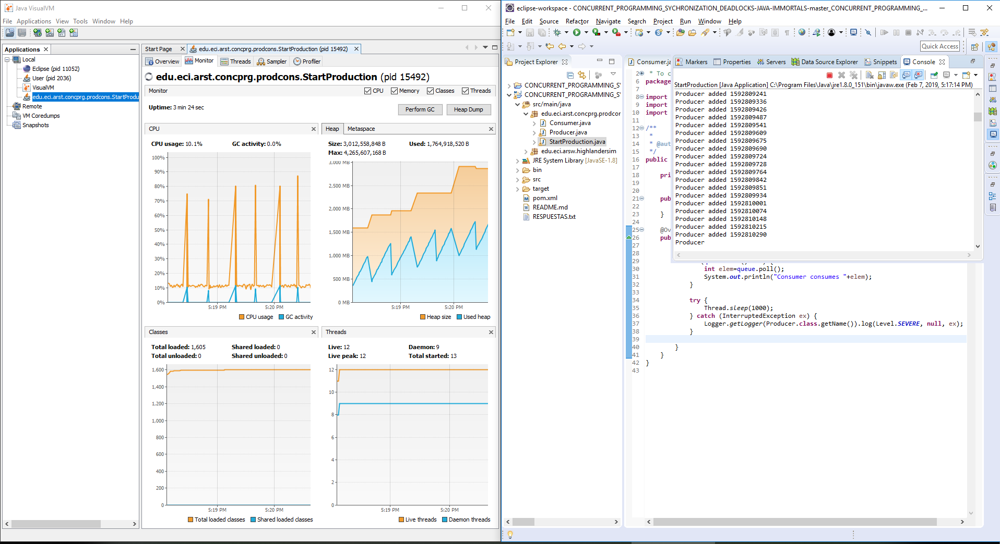

  
  
### Escuela Colombiana de Ingeniería
### Arquitecturas de Software – ARSW


## Laboratorio – Programación concurrente, condiciones de carrera y sincronización de hilos - Caso Inmortales

### Descripción
Este laboratorio tiene como fin que el estudiante conozca y aplique conceptos propios de la programación concurrente, además de estrategias que eviten condiciones de carrera.
### Dependencias:

* [Ejercicio Introducción al paralelismo - Hilos - BlackList Search](https://github.com/ARSW-ECI-beta/PARALLELISM-JAVA_THREADS-INTRODUCTION_BLACKLISTSEARCH)
#### Parte I – Antes de terminar la clase.

Control de hilos con wait/notify. Productor/consumidor.

1. Revise el funcionamiento del programa y ejecútelo. Mientras esto ocurren, ejecute jVisualVM y revise el consumo de CPU del proceso correspondiente. A qué se debe este consumo?, cual es la clase responsable?
2. Haga los ajustes necesarios para que la solución use más eficientemente la CPU, teniendo en cuenta que -por ahora- la producción es lenta y el consumo es rápido. Verifique con JVisualVM que el consumo de CPU se reduzca.
3. Haga que ahora el productor produzca muy rápido, y el consumidor consuma lento. Teniendo en cuenta que el productor conoce un límite de Stock (cuantos elementos debería tener, a lo sumo en la cola), haga que dicho límite se respete. Revise el API de la colección usada como cola para ver cómo garantizar que dicho límite no se supere. Verifique que, al poner un límite pequeño para el 'stock', no haya consumo alto de CPU ni errores.

#### Codificación Consumer:

```java
package edu.eci.arst.concprg.prodcons;

import java.util.Queue;
import java.util.logging.Level;
import java.util.logging.Logger;

public class Consumer extends Thread{
    
    private Queue<Integer> queue;
    
    
    public Consumer(Queue<Integer> queue){
        this.queue=queue;        
    }
    
    @Override
    public void run() {
        while (true) {

            if (queue.size() > 0) {
                int elem=queue.poll();
                System.out.println("Consumer consumes "+elem);                                
            }
            
            try {
                Thread.sleep(1000);
            } catch (InterruptedException ex) {
                Logger.getLogger(Producer.class.getName()).log(Level.SEVERE, null, ex);
            }
        }
    }
}

```

#### Codificación Producer:

```java
package edu.eci.arst.concprg.prodcons;

import java.util.Queue;
import java.util.Random;
import java.util.logging.Level;
import java.util.logging.Logger;

public class Producer extends Thread {

    private Queue<Integer> queue = null;

    private int dataSeed = 0;
    private int cnt=0;
    private Random rand=null;
    private final long stockLimit;

    public Producer(Queue<Integer> queue,long stockLimit) {
        this.queue = queue;
        rand = new Random(System.currentTimeMillis());
        this.stockLimit=stockLimit;
    }

    @Override
    public void run() {
        while (true) {

            dataSeed = dataSeed + rand.nextInt(100);
            System.out.println("Producer added " + dataSeed);
       
            queue.add(dataSeed);
           
            try {
                Thread.sleep(1000);
            } catch (InterruptedException ex) {
                Logger.getLogger(Producer.class.getName()).log(Level.SEVERE, null, ex);
            }
        }
    }
}
```

#### Codificación StartProduction:

```java
package edu.eci.arst.concprg.prodcons;

import java.util.ArrayList;
import java.util.List;
import java.util.Queue;
import java.util.concurrent.ArrayBlockingQueue;
import java.util.concurrent.BlockingQueue;
import java.util.concurrent.ConcurrentLinkedQueue;
import java.util.concurrent.LinkedBlockingQueue;
import java.util.logging.Level;
import java.util.logging.Logger;

public class StartProduction {
    
    
    public static void main(String[] args) {
        
        Queue<Integer> queue=new LinkedBlockingQueue<>(Integer.MAX_VALUE);
        
        
        new Producer(queue,Integer.MAX_VALUE).start();
        
        //let the producer create products for 5 seconds (stock).
        try {
            Thread.sleep(5000);
        } catch (InterruptedException ex) {
            Logger.getLogger(StartProduction.class.getName()).log(Level.SEVERE, null, ex);
        }

        new Consumer(queue).start();
    }
    

}
```
#### Grafica proceso 1 Consumer/Producer:



#### Grafica proceso 2 Consumer/Producer:



#### Grafica consumo extra de procesador 1:



#### Grafica consumo extra de procesador 2:



#### Parte II. – Antes de terminar la clase.

Teniendo en cuenta los conceptos vistos de condición de carrera y sincronización, haga una nueva versión -más eficiente- del ejercicio anterior (el buscador de listas negras). En la versión actual, cada hilo se encarga de revisar el host en la totalidad del subconjunto de servidores que le corresponde, de manera que en conjunto se están explorando la totalidad de servidores. Teniendo esto en cuenta, haga que:

- La búsqueda distribuida se detenga (deje de buscar en las listas negras restantes) y retorne la respuesta apenas, en su conjunto, los hilos hayan detectado el número de ocurrencias requerido que determina si un host es confiable o no (_BLACK_LIST_ALARM_COUNT_).
- Lo anterior, garantizando que no se den condiciones de carrera.

#### Codificación HostBlackListsValidator:

```java
package edu.eci.arsw.blackList;

import edu.eci.arsw.spamkeywordsdatasource.HostBlacklistsDataSourceFacade;
import java.util.ArrayList;
import java.util.LinkedList;
import java.util.List;
import java.util.logging.Level;
import java.util.logging.Logger;

public class HostBlackListsValidator {

	private static final int BLACK_LIST_ALARM_COUNT = 5;

	/**
	 * Check the given host's IP address in all the available black lists, and
	 * report it as NOT Trustworthy when such IP was reported in at least
	 * BLACK_LIST_ALARM_COUNT lists, or as Trustworthy in any other case. The search
	 * is not exhaustive: When the number of occurrences is equal to
	 * BLACK_LIST_ALARM_COUNT, the search is finished, the host reported as NOT
	 * Trustworthy, and the list of the five blacklists returned.
	 *
	 * @param ipaddress suspicious host's IP address.
	 * @return Blacklists numbers where the given host's IP address was found.
	 */
	public List<Integer> checkHost(String ipaddress, int threads) {

		LinkedList<Integer> blackListOcurrences = new LinkedList<>();

		int ocurrencesCount = 0;
		ArrayList<ThreadCheckList> searchers = new ArrayList<ThreadCheckList>();
		HostBlacklistsDataSourceFacade skds = HostBlacklistsDataSourceFacade.getInstance();
		int checkedListsCount = 0;
		int size = skds.getRegisteredServersCount() / threads;
		int actual = 0;

		for (int i = 0; i < threads; i++) {
			if (i == threads - 1) {
				searchers.add(new ThreadCheckList(skds, actual, skds.getRegisteredServersCount(),
						BLACK_LIST_ALARM_COUNT, ipaddress));
			} else {
				searchers.add(new ThreadCheckList(skds, actual, actual + size, BLACK_LIST_ALARM_COUNT, ipaddress));
			}
			searchers.get(i).start();
			actual += size;

		}
		boolean notAllFound = false;
		while (notAllFound) {
			synchronized (this) {
				for (int i = 0; i < threads; i++) {
					if (searchers.get(i).getOcurrences() >= BLACK_LIST_ALARM_COUNT) {
						notAllFound = false;
						for (int j = 0; j < threads; j++) {
							searchers.get(j).stop();
						}
					}
				}
			}
		}
		for (int i = 0; i < threads; i++) {
			try {
				searchers.get(i).join();
			} catch (InterruptedException e) {
				e.printStackTrace();
			}
			ocurrencesCount += searchers.get(i).getOcurrences();
			blackListOcurrences.addAll(searchers.get(i).getBlackListOcurrences());
		}

		if (ocurrencesCount >= BLACK_LIST_ALARM_COUNT) {
			skds.reportAsNotTrustworthy(ipaddress);
		} else {
			skds.reportAsTrustworthy(ipaddress);
		}
		LOG.log(Level.INFO, "Checked Black Lists:{0} of {1}",
				new Object[] { checkedListsCount, skds.getRegisteredServersCount() });

		return blackListOcurrences;
	}

	private static final Logger LOG = Logger.getLogger(HostBlackListsValidator.class.getName());

}
```

#### Codificación Main:

```java
package edu.eci.arsw.blackList;

import java.util.List;

public class Main {
    
    public static void main(String a[]){
        HostBlackListsValidator hblv=new HostBlackListsValidator();
        int threads = 50;
        System.out.println("threads: "+ threads);
        List<Integer> blackListOcurrences=hblv.checkHost("202.24.34.55", threads);
        System.out.println("The host was found in the following blacklists:"+blackListOcurrences);
        
    }
    
}
```

#### Parte II. – Avance para la siguiente clase

Sincronización y Dead-Locks.


1. Revise el programa “highlander-simulator”, dispuesto en el paquete edu.eci.arsw.highlandersim. Este es un juego en el que:

	* Se tienen N jugadores inmortales.
	* Cada jugador conoce a los N-1 jugador restantes.
	* Cada jugador, permanentemente, ataca a algún otro inmortal. El que primero ataca le resta M puntos de vida a su contrincante, y aumenta en esta misma cantidad sus propios puntos de vida.
	* El juego podría nunca tener un único ganador. Lo más probable es que al final sólo queden dos, peleando indefinidamente quitando y sumando puntos de vida.

2. Revise el código e identifique cómo se implemento la funcionalidad antes indicada. Dada la intención del juego, un invariante debería ser que la sumatoria de los puntos de vida de todos los jugadores siempre sea el mismo(claro está, en un instante de tiempo en el que no esté en proceso una operación de incremento/reducción de tiempo). Para este caso, para N jugadores, cual debería ser este valor?.

3. Ejecute la aplicación y verifique cómo funcionan las opción ‘pause and check’. Se cumple el invariante?.

4. Una primera hipótesis para que se presente la condición de carrera para dicha función (pause and check), es que el programa consulta la lista cuyos valores va a imprimir, a la vez que otros hilos modifican sus valores. Para corregir esto, haga lo que sea necesario para que efectivamente, antes de imprimir los resultados actuales, se pausen todos los demás hilos. Adicionalmente, implemente la opción ‘resume’.

5. Verifique nuevamente el funcionamiento (haga clic muchas veces en el botón). Se cumple o no el invariante?.

6. Identifique posibles regiones críticas en lo que respecta a la pelea de los inmortales. Implemente una estrategia de bloqueo que evite las condiciones de carrera. Recuerde que si usted requiere usar dos o más ‘locks’ simultáneamente, puede usar bloques sincronizados anidados:

	```java
	synchronized(locka){
		synchronized(lockb){
			…
		}
	}
	```

7. Tras implementar su estrategia, ponga a correr su programa, y ponga atención a si éste se llega a detener. Si es así, use los programas jps y jstack para identificar por qué el programa se detuvo.

8. Plantee una estrategia para corregir el problema antes identificado (puede revisar de nuevo las páginas 206 y 207 de _Java Concurrency in Practice_).

9. Una vez corregido el problema, rectifique que el programa siga funcionando de manera consistente cuando se ejecutan 100, 1000 o 10000 inmortales. Si en estos casos grandes se empieza a incumplir de nuevo el invariante, debe analizar lo realizado en el paso 4.

10. Un elemento molesto para la simulación es que en cierto punto de la misma hay pocos 'inmortales' vivos realizando peleas fallidas con 'inmortales' ya muertos. Es necesario ir suprimiendo los inmortales muertos de la simulación a medida que van muriendo. Para esto:
	* Analizando el esquema de funcionamiento de la simulación, esto podría crear una condición de carrera? Implemente la funcionalidad, ejecute la simulación y observe qué problema se presenta cuando hay muchos 'inmortales' en la misma. Escriba sus conclusiones al respecto en el archivo RESPUESTAS.txt.
	* Corrija el problema anterior __SIN hacer uso de sincronización__, pues volver secuencial el acceso a la lista compartida de inmortales haría extremadamente lenta la simulación.

11. Para finalizar, implemente la opción STOP.


<a rel="license" href="http://creativecommons.org/licenses/by-nc/4.0/"></a><br />Este contenido hace parte del curso Arquitecturas de Software del programa de Ingeniería de Sistemas de la Escuela Colombiana de Ingeniería, y está licenciado como <a rel="license" href="http://creativecommons.org/licenses/by-nc/4.0/">Creative Commons Attribution-NonCommercial 4.0 International License</a>.
